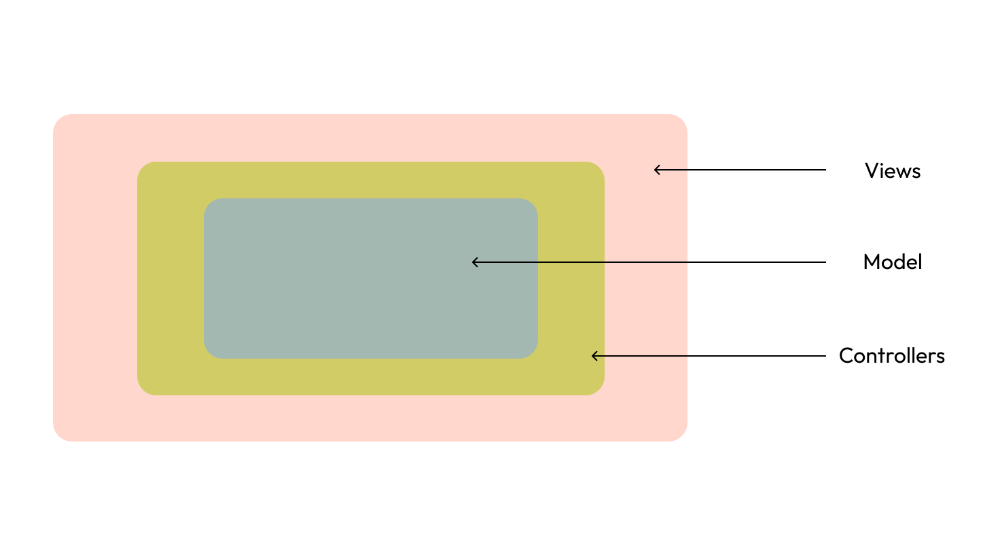

## Project Overview
### 1. Architecture

This project is designed using `MVC` architecture that involves the following three compenents.

1. `Model` - This represents the data that is being used by `DBMS` or the `response/requests`.
2. `View` - This represents the `UI-Views` that are being served to the user (here it's not used in this project).
3. `Controllers` - This represents the controllers that controls the incoming requests.

### 2. Database
The ***DataBase*** used here is `MySQL` - Relational database. It contains two columns `users` and `todos`.

* `users` table is used to store the user's data.
* `todos` table is used to store all th todos
* Both of the tables are connected by `userid`, `userid` in `users-table` is ***primary key*** of users and ***foreign-key*** in todos.

### 3. Codebase
The codebase in designed in Three-Layered approach to maintain `S.O.L.I.D` principles and loose coupling.
The Code contains `Four` main files for all the routes.

* `Routes` - Which contains all the endpoints related to that features.
* `Controllers` - This file contains all the `sub-routes` to redirect the request.
* `Models` - This file define the blueprints of the data being used as `request` and `response`.
* `Repositories` - This file is the inner-most layer to interact with `database`.

Apart from the above files, there is also some `config` files for the `global-use`
These are located at `nodejs-assignment/config`

* `db` - this is the configuration file for the establishment of connections to database and interactions with it.
* `auth` - this file is used to authenticated user during login and generate `JWT-Token`.
* `authenticateMiddleware` - this file is `middleware` used to verify `JWT-token`.

>Cheers :) That's all we have here, Thanks!